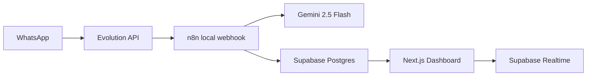

# Clinica Sorriso Feliz

AI WhatsApp Agent and operations dashboard for a dental clinic.

- Dashboard publico: [odonto-g20wjtdi5-kaduhxl7s-projects.vercel.app](https://odonto-g20wjtdi5-kaduhxl7s-projects.vercel.app)](https://odonto-10czubw8e-kaduhxl7s-projects.vercel.app)
- Repository: https://github.com/Kaduhxl7/Clinica-Sorriso-Feliz-

No mock data is used. The dashboard reads only from Supabase tables populated by the n8n WhatsApp workflow.

## Architecture



Main responsibilities:

- Evolution API receives and sends WhatsApp messages.
- n8n normalizes inbound events, ignores bot messages, loads memory, classifies intent, generates the response, writes Supabase records, and sends the answer through Evolution.
- Gemini 2.5 Flash handles intent classification and contextual generation.
- Supabase stores conversations, messages, and metrics with RLS and realtime publication.
- Next.js displays the real operational dashboard with Supabase Auth protection.

## Features

- WhatsApp webhook workflow for Evolution API.
- Gemini intent classification: `AGENDAMENTO`, `ORCAMENTO`, `DUVIDA`, `HUMANO`.
- Gemini sentiment classification: `POSITIVO`, `NEUTRO`, `NEGATIVO`.
- Conversation status tracking: `em_andamento`, `aguardando_humano`, `encerrada`.
- Conversation memory loaded from Supabase before the AI response.
- Automatic WhatsApp response through Evolution API.
- Dashboard metrics: total conversations, total messages, conversations by day.
- Advanced analytics: intent distribution, sentiment distribution, status distribution, messages by day, conversation growth.
- Conversation inbox with search by phone, message keyword, status, intent, sentiment, date range, and human-only mode.
- Human attention indicator for `HUMANO` intent and `aguardando_humano` status.
- Supabase Realtime auto-refresh for conversations, messages, and metrics.
- Supabase Auth login.
- Dark mode and light mode with persisted preference.
- Responsive UI for desktop and mobile.
- Lightweight automated tests and GitHub Actions CI.

## Project Structure

```text
app/
  conversations/
    [id]/page.tsx
    page.tsx
  login/page.tsx
  actions.ts
  error.tsx
  globals.css
  layout.tsx
  loading.tsx
  not-found.tsx
  page.tsx
components/
  app-shell.tsx
  conversation-filters.tsx
  conversation-thread.tsx
  conversations-table.tsx
  dashboard-charts.tsx
  metric-card.tsx
  realtime-refresh.tsx
  status-badge.tsx
  theme-provider.tsx
  theme-toggle.tsx
docs/
  database.md
  erd-and-n8n-workflow.md
  final-local-runtime-setup.md
  local-n8n-architecture.md
  n8n-workflow-setup.md
lib/
  hooks/use-supabase-realtime-refresh.ts
  supabase/client.ts
  supabase/middleware.ts
  supabase/queries.ts
  supabase/server.ts
  types.ts
  utils.ts
n8n/
  workflows/clinica-sorriso-feliz-whatsapp-ai-agent.json
supabase/
  migrations/
tests/
  dashboard.test.mjs
  workflow.test.mjs
```

## Database

Run the SQL files in order in Supabase:

1. `supabase/migrations/001_ai_whatsapp_agent_schema.sql`
2. `supabase/migrations/002_enable_realtime_for_dashboard.sql`
3. `supabase/migrations/003_grant_agent_dashboard_permissions.sql`
4. `supabase/migrations/004_add_conversation_sentiment.sql`

Core tables:

- `conversations`: one active or historical WhatsApp conversation per patient/instance.
- `messages`: inbound and outbound messages, including AI metadata and intent.
- `conversation_metrics`: aggregate metrics for dashboard and operational review.

Sentiment persistence:

- `conversation_sentiment` enum stores `POSITIVO`, `NEUTRO`, or `NEGATIVO`.
- `conversations.sentiment` and `conversations.sentiment_confidence` store the latest conversation-level classification.
- `messages.sentiment` and `messages.sentiment_confidence` store the sentiment associated with each interaction.
- Sentiment columns are nullable so old rows remain valid and continue rendering as `Sem sentimento`.

Security model:

- RLS is enabled.
- Authenticated dashboard users can read data.
- n8n writes through the Supabase service role key.
- The dashboard never uses the service role key.

Detailed database documentation is available in `docs/database.md` and `docs/erd-and-n8n-workflow.md`.

## Workflow

Workflow file:

```text
n8n/workflows/clinica-sorriso-feliz-whatsapp-ai-agent.json
```

Required runtime path:

```text
Evolution API -> n8n Webhook -> Supabase memory lookup -> Gemini intent/sentiment classification -> Gemini response -> Evolution sendText -> Supabase persistence
```

Sentiment pipeline:

1. n8n loads recent message history from Supabase.
2. Gemini returns `intent`, `confidence`, `sentiment`, `sentiment_confidence`, `needs_human`, `handoff_reason`, and `summary`.
3. n8n validates allowed sentiment values and falls back to `NEUTRO` if Gemini returns an unknown value.
4. n8n stores intent and sentiment in the inbound message.
5. n8n updates the conversation with the latest intent, sentiment, summary, and handoff status.
6. The dashboard reads sentiment from Supabase and exposes counters, badges, filters, and charts.

Webhook endpoint in local n8n:

```text
http://localhost:5678/webhook/evolution/whatsapp/incoming
```

When n8n runs inside Docker and Evolution API runs on the Windows host, Evolution should call:

```text
http://host.docker.internal:5678/webhook/evolution/whatsapp/incoming
```

See `docs/n8n-workflow-setup.md` and `docs/final-local-runtime-setup.md` for import and validation steps.

## Environment Variables

Dashboard `.env.local`:

```text
NEXT_PUBLIC_SUPABASE_URL=MANUAL_REPLACE_WITH_SUPABASE_PROJECT_URL
NEXT_PUBLIC_SUPABASE_ANON_KEY=MANUAL_REPLACE_WITH_SUPABASE_ANON_KEY
```

n8n local `.env`:

```text
N8N_BASIC_AUTH_USER=MANUAL_REPLACE_WITH_LOCAL_USER
N8N_BASIC_AUTH_PASSWORD=MANUAL_REPLACE_WITH_STRONG_PASSWORD
N8N_ENCRYPTION_KEY=MANUAL_REPLACE_WITH_32_PLUS_CHARACTER_KEY
N8N_WEBHOOK_URL=http://localhost:5678/
POSTGRES_DB=n8n
POSTGRES_USER=n8n
POSTGRES_PASSWORD=MANUAL_REPLACE_WITH_STRONG_POSTGRES_PASSWORD
EVOLUTION_API_URL=http://host.docker.internal:8080
EVOLUTION_INSTANCE_NAME=MANUAL_REPLACE_WITH_EVOLUTION_INSTANCE
EVOLUTION_API_KEY=MANUAL_REPLACE_WITH_EVOLUTION_API_KEY
SUPABASE_URL=MANUAL_REPLACE_WITH_SUPABASE_PROJECT_URL
SUPABASE_SERVICE_ROLE_KEY=MANUAL_REPLACE_WITH_SUPABASE_SERVICE_ROLE_KEY
GEMINI_API_KEY=MANUAL_REPLACE_WITH_GEMINI_API_KEY
GEMINI_MODEL=gemini-2.5-flash
```

Never commit real secrets.

## Local Development

Install dependencies:

```bash
npm install
```

Run the dashboard:

```bash
npm run dev
```

Open:

```text
http://localhost:3000
```

Run local n8n stack:

```bash
docker compose up -d
```

Open n8n:

```text
http://localhost:5678
```

## Validation

Run:

```bash
npm run typecheck
npm test
npm run build
```

Connectivity checks:

- Evolution send: call `/message/sendText/{instance}` and confirm WhatsApp delivery.
- Evolution webhook: send a real WhatsApp message and confirm a new n8n execution.
- Supabase: check `conversations`, `messages`, and `conversation_metrics` rows.
- Gemini: confirm the workflow receives classification and response JSON.
- Dashboard: login with Supabase Auth and confirm metrics update after a WhatsApp message.

## Deployment

The dashboard is compatible with Vercel.

Vercel variables:

```text
NEXT_PUBLIC_SUPABASE_URL
NEXT_PUBLIC_SUPABASE_ANON_KEY
```

The n8n workflow is intentionally run outside Vercel because it owns server-side credentials for Evolution, Gemini, and Supabase service role.

## Decisions

- Supabase service role key is restricted to n8n because dashboard code runs in a user-facing web app.
- Realtime refresh is debounced to avoid excessive route refreshes when n8n inserts multiple rows in sequence.
- Sentiment analysis is implemented as migration `004` with nullable fields to preserve compatibility with historical data.
- The n8n workflow v2 writes sentiment fields, so apply migration `004` before importing or activating the updated workflow.
- Tests validate the critical JSON workflow and dashboard capabilities without adding heavy testing infrastructure.

## Vibe Coding Journal

AI tools used:

- Codex for full-stack implementation, review, SQL, workflow design, debugging, and documentation.
- Gemini 2.5 Flash as the runtime model configured in the n8n workflow for patient intent and response generation.

Main prompts used during development:

- Design Supabase schema for WhatsApp AI agent conversations, messages, metrics, status, and intent tracking.
- Generate production n8n workflow for Evolution API, Gemini, Supabase, memory, handoff, and error handling.
- Build Next.js dashboard with Supabase realtime, metrics, conversation list, detail page, and auth.
- Audit the project against the hiring challenge and implement missing high-impact differentials.

Failures encountered and fixes:

- Local n8n needed Docker networking adjustments because Evolution API runs on the Windows host. The setup uses `host.docker.internal` from inside Docker.
- Dashboard credentials are not Supabase database credentials; login requires a Supabase Auth user.
- Realtime can fire multiple events for one WhatsApp exchange, so refresh calls are debounced.
- External deploy verification may fail from restricted environments; local production build and CI validate Vercel compatibility.

## Challenge Compliance

| Requirement | Status | Evidence |
| --- | --- | --- |
| WhatsApp webhook | Implemented | `Evolution Webhook - Incoming WhatsApp` node |
| Evolution API send | Implemented | `Evolution - Send WhatsApp Response` node |
| Gemini integration | Implemented | classification and response nodes |
| Conversation memory | Implemented | Supabase history lookup and memory context node |
| Intent classification | Implemented | Gemini classification and Supabase persistence |
| Sentiment classification | Implemented | Gemini classification, migration `004`, dashboard badges, filters, metrics, and chart |
| Real database | Implemented | Supabase migrations and dashboard queries |
| Dashboard metrics | Implemented | `app/page.tsx`, `components/dashboard-charts.tsx` |
| Conversation list/detail | Implemented | `app/conversations` pages |
| Realtime | Implemented | `use-supabase-realtime-refresh.ts` |
| Public deployment | Implemented | Vercel URL documented above |
| README and setup docs | Implemented | `README.md` and `docs/` |
| Automated tests | Implemented | `tests/*.test.mjs` |
| CI/CD | Implemented | `.github/workflows/ci.yml` |
