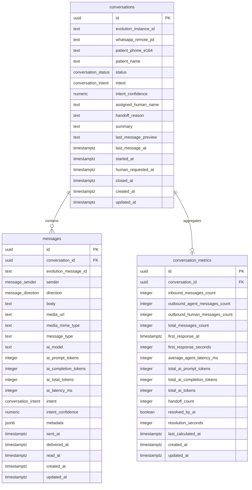

# ERD and n8n Workflow

## ERD Description

Relationships:

- One `conversation` has many `messages`.
- One `conversation` has zero or one `conversation_metrics` row.
- `messages.conversation_id` cascades deletes from `conversations`.
- `conversation_metrics.conversation_id` cascades deletes from `conversations`.

## n8n Workflow Interaction

### 1. Receive WhatsApp Message

Trigger:

- Evolution API sends an inbound webhook to n8n Cloud.

n8n extracts:

- `evolution_instance_id`
- `whatsapp_remote_jid`
- `evolution_message_id`
- patient phone in E.164 format
- patient name, when available
- message text or media URL
- message timestamp

Database interaction:

1. Search `conversations` for an active row using:
   - `evolution_instance_id`
   - `whatsapp_remote_jid`
   - `status IN ('em_andamento', 'aguardando_humano')`
2. If none exists, insert a new `conversations` row with:
   - `status = 'em_andamento'`
   - patient identifiers
   - `started_at = incoming message timestamp or now()`
3. Insert inbound row into `messages`:
   - `conversation_id`
   - `evolution_message_id`
   - `sender = 'patient'`
   - `direction = 'inbound'`
   - `body` or `media_url`
   - `message_type`
   - `metadata` with relevant Evolution payload and n8n execution id

The database trigger updates:

- `conversations.last_message_at`
- `conversations.last_message_preview`
- `conversation_metrics` counts

### 2. Classify Intent With Gemini 2.5 Flash

n8n sends the latest patient message plus recent conversation context to Gemini 2.5 Flash.

Expected classification output:

- `intent`: one of `AGENDAMENTO`, `ORCAMENTO`, `DUVIDA`, `HUMANO`
- `intent_confidence`: decimal from `0` to `1`
- optional `summary`
- optional `handoff_reason`

Database interaction:

Update `conversations`:

- `intent`
- `intent_confidence`
- `summary`, when generated

If `intent = HUMANO` or safety/business rules require handoff:

- set `status = 'aguardando_humano'`
- set `human_requested_at = now()`
- set `handoff_reason`

Also update the inbound `messages` row with message-level:

- `intent`
- `intent_confidence`
- `metadata.gemini_classification`, if desired by the n8n Supabase node or HTTP request body

### 3. Generate AI Response

When `status = 'em_andamento'`, n8n asks Gemini 2.5 Flash to create the response.

Recommended prompt inputs:

- clinic name: Clinica Sorriso Feliz
- current patient message
- recent message history from `messages`
- conversation intent from `conversations.intent`
- guardrails for dental triage, scheduling, and handoff

Database interaction:

Insert outbound AI message into `messages`:

- `sender = 'agent'`
- `direction = 'outbound'`
- `body = Gemini response`
- `ai_model = 'gemini-2.5-flash'`
- token and latency fields, when available
- `metadata` with prompt version, n8n execution id, and Gemini response id if available

Then n8n calls Evolution API to send the WhatsApp message.

If Evolution API returns a channel message id after sending, update:

- `messages.evolution_message_id`
- delivery metadata

### 4. Escalate to Human

When `status = 'aguardando_humano'`, n8n should not let the AI continue normal responses.

Recommended behavior:

- Send a short confirmation to the patient, such as informing that the clinic team will continue the conversation.
- Notify staff through the chosen internal channel.
- Keep incoming patient messages inserted into `messages`.

Database interaction:

- Continue inserting patient messages as `sender = 'patient'`, `direction = 'inbound'`.
- Insert internal notes as `sender = 'system'`, `direction = 'internal'`.
- When a staff member replies through the dashboard or another n8n path, insert `sender = 'human'`, `direction = 'outbound'`.
- Call Evolution API to send the human message.

### 5. Close Conversation

When the appointment is booked, quote flow is complete, question is resolved, or staff manually closes the chat:

Update `conversations`:

- `status = 'encerrada'`
- `closed_at = now()`
- `summary = final AI or human summary`

The database trigger updates:

- `conversation_metrics.resolved_by_ai`
- `conversation_metrics.resolution_seconds`

### 6. Dashboard Reads

Next.js dashboard should read:

- `conversations` for inbox lists and filters by status/intent.
- `messages` by `conversation_id` for chat transcript views.
- `conversation_metrics` for reporting cards and analytics.

Recommended dashboard filters:

- Open conversations: `status = 'em_andamento'`
- Human queue: `status = 'aguardando_humano'`
- Closed history: `status = 'encerrada'`
- By intent: `AGENDAMENTO`, `ORCAMENTO`, `DUVIDA`, `HUMANO`
- Sort by `last_message_at DESC NULLS LAST`

## Practical n8n Node Map

Recommended node sequence:

1. Webhook node receives Evolution API event.
2. Set node normalizes payload fields.
3. Supabase node searches active `conversations`.
4. IF node creates conversation when missing.
5. Supabase node inserts inbound `messages`.
6. Supabase node fetches recent `messages` context.
7. Gemini node classifies intent.
8. IF node branches between AI response and human handoff.
9. Supabase node updates `conversations`.
10. Gemini node generates answer when AI should continue.
11. Supabase node inserts outbound AI `messages`.
12. HTTP Request node sends message via Evolution API.
13. Supabase node updates outbound message with Evolution delivery identifiers.

Use Supabase service role credentials in n8n because the workflow performs server-side inserts and updates.
